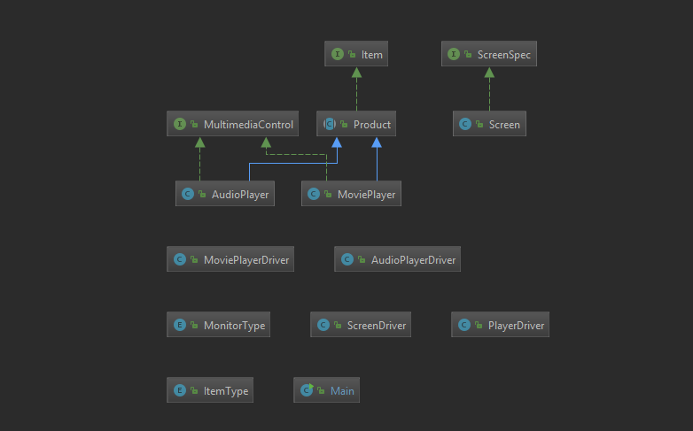

# JP PROJECT BETA
<b>Overview</b> 
  Creation of a program in Java for creating and recording all future production line items.

<b>Interface</b> 
  The interface Item is created so every class that implements the interface will be able to have the characteristics
  of an item. These are characteristics such as, product number, item name, serial number, and manufactur date as
  well as get methods for them.
  
<b>Enum</b> 
  The enum ItemType is created so that there can be a special data type, ItemType, to describe what the item in production
  is. This can activiely be dynamically changed to increase the number of items in production.
  
<b>Abstract</b> 
  The abstract class Product is used to bring the interface and enum together. Here the class has a constructor that
  gathers all of the created methods and fields into one product being made. It implements all of the methods from the
  Item interface and will provide a type for the product. It also overrides the toString method to provide a pre-formatted
  message describing the product created.

<b>Class Diagram</b> 

